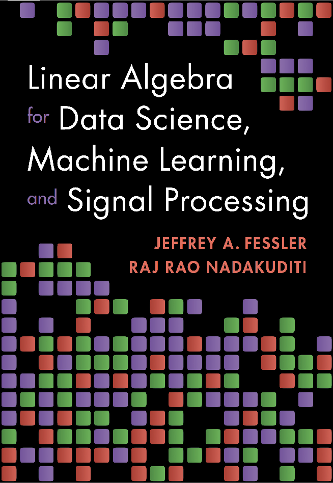

# Demos for book "Linear algebra for DS, ML and SP"

[![license][license-img]][license-url]
[![demos][demos-img]][demos-url]

https://github.com/JeffFessler/book-la-demo

This repo contains demo code
in the
[Julia language](https://julialang.org/)
to accompany the book
"Linear Algebra for
Data Science, Machine Learning, and Signal Processing"
(formerly known as "Matrix Methods and Applications")
by Jeff Fessler
and Raj Nadakuditi
of the University of Michigan.
Forthcoming in 2024 from Cambridge University Press.

The demos expect Julia 1.9 or above.

To view the demos,
click this button:
[![demos][demos-img]][demos-url]

[![Table of contents][toc-img]][toc-url]
of the book.

## Samples

Here are some examples of the kinds of figures generated in the demos.

- [Binary classification](https://jefffessler.github.io/book-la-demo/generated/demos/09/class01)

- [Video foreground/background separation](https://jefffessler.github.io/book-la-demo/generated/demos/10/foreback)

- [Non-negative matrix factorization](https://jefffessler.github.io/book-la-demo/generated/demos/10/nmf)

- [Photometric stereo](https://jefffessler.github.io/book-la-demo/generated/demos/07/photometric3)

- [Preconditioning](https://jefffessler.github.io/book-la-demo/generated/demos/09/precon1)

- [Source localization](https://jefffessler.github.io/book-la-demo/generated/demos/07/source-local)

- [Spectral clustering](https://jefffessler.github.io/book-la-demo/generated/demos/08/spectral-cluster)

# Demo index

- [1.1 Julia overview](https://jefffessler.github.io/book-la-demo/generated/demos/01/1-intro/)
- [1.2 Julia vectors](https://jefffessler.github.io/book-la-demo/generated/demos/01/2-vector/)

- [2.1 convolution](https://jefffessler.github.io/book-la-demo/generated/demos/02/conv-mat)
- [2.2 dot product](https://jefffessler.github.io/book-la-demo/generated/demos/02/dot)
- [2.3 outer product](https://jefffessler.github.io/book-la-demo/generated/demos/02/outer)
- [2.4 matrix-vector multiplication](https://jefffessler.github.io/book-la-demo/generated/demos/02/mul-mat-vec)
- [2.5 heatmap](https://jefffessler.github.io/book-la-demo/generated/demos/02/gauss2d)

- [4.1 SVD of finite differences](https://jefffessler.github.io/book-la-demo/generated/demos/04/svd-diff)

- [5.1 lifting for LS](https://jefffessler.github.io/book-la-demo/generated/demos/05/ls-lift)
- [5.2 LS fits](https://jefffessler.github.io/book-la-demo/generated/demos/05/ls-fit1)
- [5.3 LS cost functions](https://jefffessler.github.io/book-la-demo/generated/demos/05/ls-cost1)
- [5.4 frames and image denoising with wavelets](https://jefffessler.github.io/book-la-demo/generated/demos/05/frame-cycle)
- [5.5 cross validation](https://jefffessler.github.io/book-la-demo/generated/demos/05/ls-cv)

- [6.1 robust regression](https://jefffessler.github.io/book-la-demo/generated/demos/06/robust-regress)
- [6.2 Procrustes](https://jefffessler.github.io/book-la-demo/generated/demos/06/procrustes)

- [7.1 Rank-1](https://jefffessler.github.io/book-la-demo/generated/demos/07/rank1)
- [7.2 Photometric stereo](https://jefffessler.github.io/book-la-demo/generated/demos/07/photometric3)
- [7.3 Source localization via MDS](https://jefffessler.github.io/book-la-demo/generated/demos/07/source-local)
- [7.4 SURE](https://jefffessler.github.io/book-la-demo/generated/demos/07/lr-sure)
- [7.5 PCA](https://jefffessler.github.io/book-la-demo/generated/demos/07/pca)

- [8.1 Spectral clustering](https://jefffessler.github.io/book-la-demo/generated/demos/08/spectral-cluster)
- [8.2 Laplacian eigenmaps](https://jefffessler.github.io/book-la-demo/generated/demos/08/eigmap)
- [8.3 Kronecker sum](https://jefffessler.github.io/book-la-demo/generated/demos/08/kron-sum-inv)

- [9.1 Preconditioning](https://jefffessler.github.io/book-la-demo/generated/demos/09/precon1)
- [9.2 Binary classification](https://jefffessler.github.io/book-la-demo/generated/demos/09/class01)

- [10.1 Matrix completion](https://jefffessler.github.io/book-la-demo/generated/demos/10/lrmc-m)
- [10.2 Matrix completion](https://jefffessler.github.io/book-la-demo/generated/demos/10/lrmc3)
- [10.3 Video foreground/background separation](https://jefffessler.github.io/book-la-demo/generated/demos/10/foreback)
- [10.4 Nonnegative matrix factorization](https://jefffessler.github.io/book-la-demo/generated/demos/10/nmf)

- [12.1 RMT and roundoff](https://jefffessler.github.io/book-la-demo/generated/demos/12/round1)
- [12.2 RMT and Noise](https://jefffessler.github.io/book-la-demo/generated/demos/12/gauss1)
- [12.3 Outliers](https://jefffessler.github.io/book-la-demo/generated/demos/12/outlier1)
- [12.4 Missing data](https://jefffessler.github.io/book-la-demo/generated/demos/12/complete1)

<!-- URLs -->
[toc-img]: https://img.shields.io/badge/-Table_of_Contents-purple
[toc-url]: https://htmlpreview.github.io/?https://github.com/JeffFessler/book-la-demo/blob/main/toc.htm
[demos-img]: https://img.shields.io/badge/-Demos-blue
[demos-url]: https://JeffFessler.github.io/book-la-demo
[license-img]: https://licensebuttons.net/l/by-nc-nd/3.0/88x31.png
[license-url]: LICENSE
