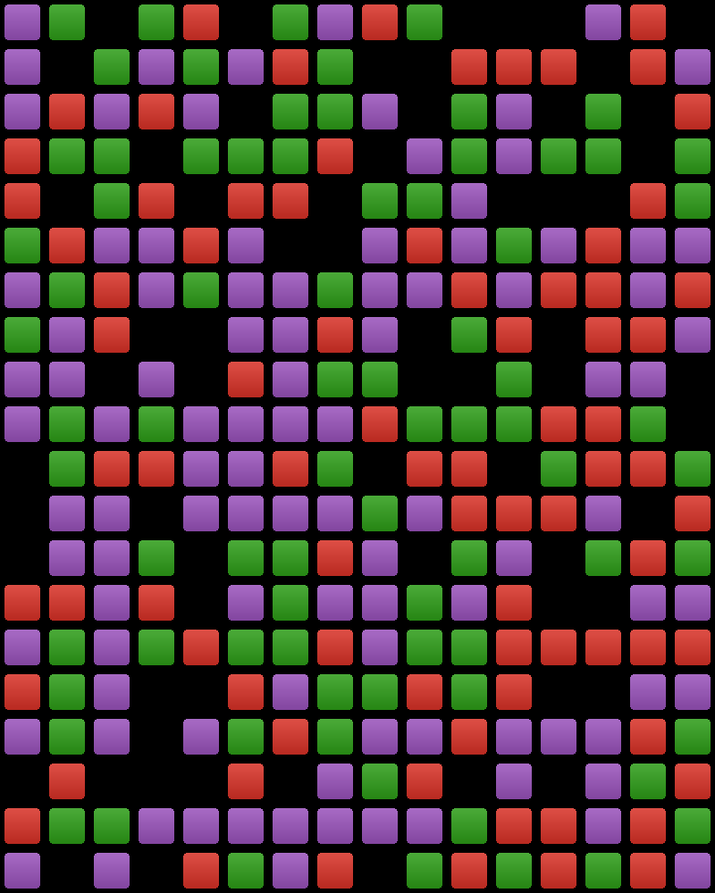

# Demos for Matrix Methods in Julia book [WIP]

[![license][license-img]][license-url]
[![demos][demos-img]][demos-url]

https://github.com/JeffFessler/book-mmaj-demo

This repo contains demo code
in the
[Julia language](https://julialang.org/)
to accompany the book
"Matrix Methods and Applications in Julia"
by Jeff Fessler
and Raj Nadakuditi
of the University of Michigan.

To view the demos,
click this button:
[![demos][demos-img]][demos-url]

## Samples

Here are some examples of the kinds of figures generated in the demos.

- [Binary classification](https://jefffessler.github.io/book-mmaj-demo/generated/demos/09/class01)

- [Video foreground/background separation](https://jefffessler.github.io/book-mmaj-demo/generated/demos/10/foreback)

- [Non-negative matrix factorization](https://jefffessler.github.io/book-mmaj-demo/generated/demos/10/nmf)

- [Photometric stereo](https://jefffessler.github.io/book-mmaj-demo/generated/demos/07/photometric3)

- [Preconditioning](https://jefffessler.github.io/book-mmaj-demo/generated/demos/09/precon1)

- [Source localization](https://jefffessler.github.io/book-mmaj-demo/generated/demos/07/source-local)

- [Spectral clustering](https://jefffessler.github.io/book-mmaj-demo/generated/demos/08/spectral-cluster)

<!-- URLs -->
[demos-img]: https://img.shields.io/badge/-Demos-blue
[demos-url]: https://JeffFessler.github.io/book-mmaj-demo
[license-img]: https://licensebuttons.net/l/by-nc-nd/3.0/88x31.png
[license-url]: LICENSE
